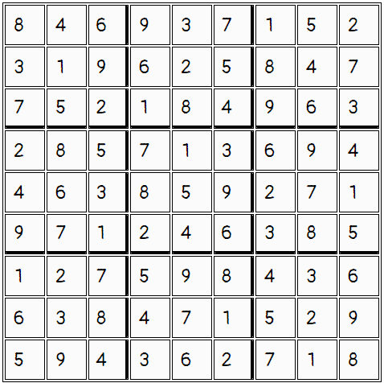

# Sudoku

An implementation of a NP-complete puzzle, Sudoku, that allows players to play the game and have their board solution verified. 
Implements backtracking to solve the sudoku puzzle and allow for users to verify their board.

## Instructions on how to run the program
- You can run this project by clicking this demo link: https://skim-sudoku.netlify.app/
- You can run this project by downloading a zip file of the project on github, unzip the file, and opening the "index.html" file in your local browser.

## Instructions on how to play the game
- Fill in the empty spaces on the board using numbers 1 to 9. You can do so by manually typing in the numbers or using the input arrow keys in the individual cells.
- There can be no repeating numbers in each row, column, or 3x3 box square.
- When you are done filling in the board, click the CHECK button to verify your solution. An alert message will pop up letting you know if you got it right or wrong.
- Click the reset button if you want to clear the board.
- Click the solution button to reveal the solution.

## Solution 

