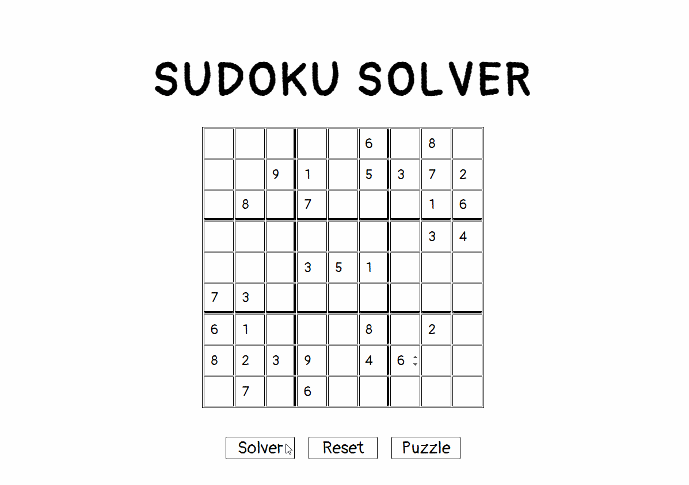
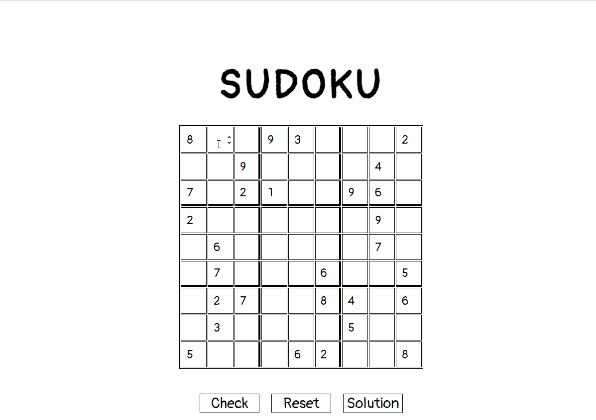
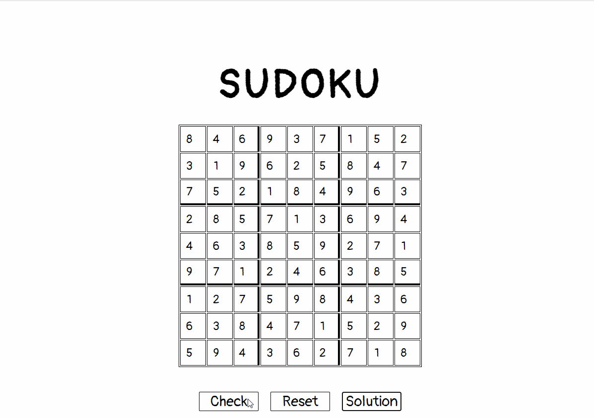

# Sudoku
https://skim-sudoku.netlify.app/

An implementation of a NP-complete puzzle, Sudoku, that allows players to input any sudoku puzzle and the algorithm will solve the board for you!
Players can also play a sudoku puzzle if the 'puzzle' button is pressed. 
Implements backtracking algorithm to solve the sudoku puzzle and allow for users to verify their board.

## TechStack

HTML, CSS, JavaScript, jQuery

## Walkthrough

- Showcasing Sudoku Board Input being solved & Reset Button Feature

- Showcasing Sudoku Board Puzzle check board and validation feature

- Showcasing Correct Sudoku Board Puzzle Validation

## Instructions on how to run the program
- You can run this project by clicking this demo link: https://skim-sudoku.netlify.app/
- You can run this project by downloading a zip file of the project from this github repo, unzip the file, and opening the "index.html" file in your local browser.

## Instructions on how to use the solver
- Input the sudoku puzzle by manually typing the numbers or by using the input arrow keys in the individual cells.
- Click the Solver button to have the algorithm solve the puzzle. The solution will be displayed.
- Click the reset button to clear the board.
- Click the puzzle button to try out a sudoku puzzle demo!

## Instructions on how to play the game
- Fill in the empty spaces on the board using numbers 1 to 9. You can do so by manually typing in the numbers or using the input arrow keys in the individual cells.
- There can be no repeating numbers in each row, column, or 3x3 box square.
- When you are done filling in the board, click the CHECK button to verify your solution. An alert message will pop up letting you know if you got it right or wrong.
- Click the reset button if you want to clear the board.
- Click the solution button to reveal the solution.

